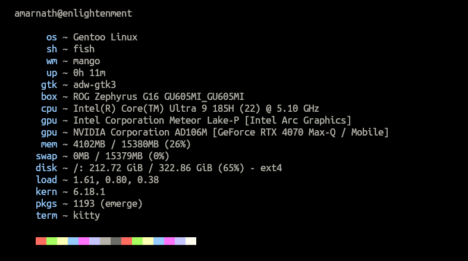

# motd

A lightweight system information fetch tool written in C++, designed for BSD (especially OpenBSD) alongside Gentoo Linux, and Alpine Linux.

## Building

This project uses [xmake](https://xmake.io/) as the build system.

### Prerequisites

- C++ compiler (g++, clang++)
- xmake

### Build for release (optimized, stripped)

```sh
xmake f -m release
xmake
```

The binary will be located at `build/<platform>/<arch>/release/motd`

### Install

```sh
xmake install
```

Or manually copy the binary:

```sh
cp build/*/release/motd ~/.local/bin/
# or
sudo cp build/*/release/motd /usr/local/bin/
```

## Usage

Simply run:

```sh
motd
```

Example output:


### Shell Integration

Add to your shell rc file (`.bashrc`, `.zshrc`, etc.):

```sh
motd
```

## Supported Systems

Supports Gentoo Linux, Alpine Linux, and OpenBSD.

## License

BSD 3-Clause License - See LICENSE file for details
